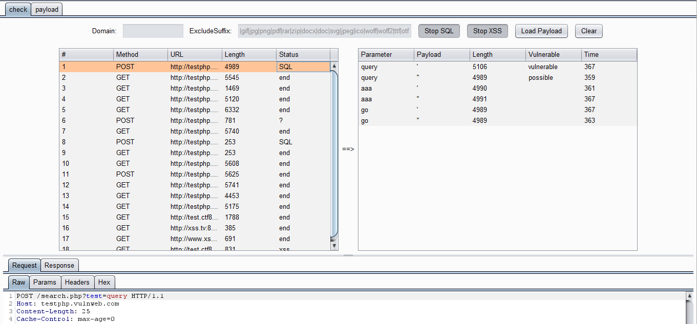

# LazyQS (Lazy sql & xss)


## 0x01 简介

在有waf的情况下，扫描器很容易导致IP被封，而手测注入和xss需要对每个参数进行测试，一套下来花费大量时间，并且容易漏测（碰到过一个网站可能就一个参数存在注入，很容易遗漏）。于是借鉴了[@smxiazi](https://github.com/smxiazi/xia_sql)[@c0ny1](https://github.com/c0ny1/passive-scan-client)两位师傅的插件，一边学习一边产出一个学习成果。


## 0x02 插件编译

```
mvn package
```


## 0x03 插件使用

##### 界面



##### 介绍

- 支持解析参数类型：

  **GET型**：aa=bb&cc=dd     aa=bb&cc={"ee":"ff","gg":5}

  **POST型**：aa=bb&cc=dd     aa=bb&cc={"ee":"ff","gg":5}    {"aa":"bb","cc":"dd"}

- 最上面就是可过滤的域名和静态文件后缀，然后是sql和xss的开关，可以只单开某一个

- 左边的状态有以下几种，显示优先级从上到下：

  **SQL**：响应包有sql报错信息

  **sql?**：双单引号回显长度异于单引号回显长度且等于原包长度

  **?**：单双引号回显长度不同

  **xss**：响应包回显了payload，只针对GET型参数

  **end**：扫描结束

- 右边的状态有以下几种，分别对应上面的状态：

  **vulnerable**

  **possible**

  **check**

  **xss**


## 0x04 插件更新

#### 2022-6-25

使用fastjson解析json类型参数，支持对域名过滤及sql报错信息检测，简单的xss探测功能


## 0x05 参考

https://github.com/smxiazi/xia_sql

https://github.com/c0ny1/passive-scan-client


